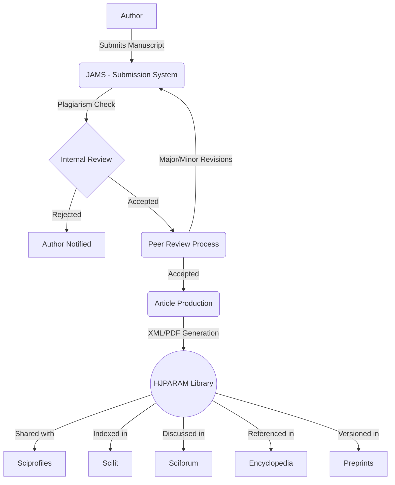

# HJPARAM Publication | Operations Guide (OG)
## Complete Flow of Process

This document outlines the end-to-end workflow of the HJPARAM Publication ecosystem, from manuscript submission to global discovery.

### 1. Publication Ecosystem Flow (JAMS & Modules)

### 2. Editorial Workflow Detail

1.  **Submission**: Authors submit via JAMS.
2.  **Initial Screening**: Managing Editor checks scope and plagiarism.
3.  **Peer Review**: Double-blind review by at least 2 independent experts.
4.  **Decision**: Editor-in-Chief makes final decision (Accept/Reject/Revise).
5.  **Production**: Formatting, copy-editing, and DOI assignment.
6.  **Publication**: Published as Open Access under CC BY license.
7.  **Dissemination**: Pushed to various ecosystem modules for maximum impact.

### 3. SEO & Connectivity Flow
- **Sitemap.xml**: Auto-generates URLs for all articles/journals.
- **Robots.txt**: Guides crawlers to high-value content.
- **OG Metadata**: Ensures premium appearance when shared on Social Media (LinkedIn, ResearchGate, Twitter).
